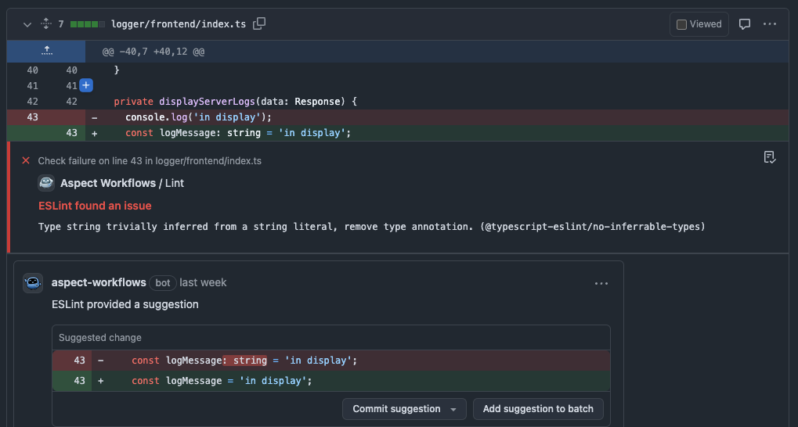

# Linting

## Installation

You must declare your linters as Bazel aspects.

> This is needed because Bazel only allows aspect attributes of type
> `bool`, `int` or `string`.
> We want to accept label-typed attributes, so we follow the documentation from
> https://bazel.build/extending/aspects#aspect_definition_2

We suggest creating a `lint.bzl` file in whatever package contains most of your
custom Bazel configuration, commonly in `tools/`.
This `lint.bzl` should contain linter aspect declarations.
See the `docs/` folder for "aspect factory functions" that declare your linters.

Finally, register those linter aspects in the lint runner. See details below.

## Usage

### 1. (Coming Soon) Linter as Code Review Bot

An upcoming release of [Aspect Workflows](https://docs.aspect.build/workflows/) will include a `lint` task, which wires the reports from bazel-out directly into your code review.
The fixes produced by the tool are shown as suggested edits, so you can just accept without a context-switch back to your development machine.



### 2. Warnings in the terminal with `bazel lint`

Aspect CLI adds the missing 'lint' command, so users just type `bazel lint //path/to:targets`.

Reports are then written to the terminal.

To configure it, add a block like the following in `.aspect/cli/config.yaml` to point to the `*_lint` definition symbols.
The syntax is the same as [aspects declared on the command-line](https://bazel.build/extending/aspects#invoking_the_aspect_using_the_command_line)

```yaml
lint:
  aspects:
    # Format: <extension file label>%<aspect top-level name>
    - //tools:lint.bzl%eslint
```

[](https://asciinema.org/a/xQWU1Wc1JINOubeguDDQbBqcq)

### 3. Warnings in the terminal with a wrapper

If you don't use Aspect CLI, you can use vanilla Bazel with some wrapper like a shell script that runs the linter aspects over the requested targets.

See the `example/lint.sh` file as an example.

[](https://asciinema.org/a/gUUuQTCGIu85YMl6zz2GJIgD8)

Note that you can also apply fixes from linters that provide them.
Pass the `--fix` flag to the `lint.sh` script.
This is the same flag many linters support.

[](https://asciinema.org/a/r9JKJ8uKgAZTzlUPdDdHlY1CB)

### 4. Errors during `bazel build`

By adding `--aspects_parameters=fail_on_violation=true` to the command-line, we pass a parameter
to our linter aspects that cause them to honor the exit code of the lint tool.

This makes the build fail when any lint violations are present.

### 5. Failures during `bazel test`

Add a [make_lint_test](./lint_test.md) call to the `lint.bzl` file, then use the resulting rule in your BUILD files or in a wrapper macro.

See the `example/test/BUILD.bazel` file in this repo for some examples.

## Linting generated files

By default, we filter out generated files from linting.

To bypass this filter, add `tags=["lint-genfiles"]` to a target to force all the `srcs` to be linted.

## Debugging

Some linters honor the debug flag in this repo. To enable it, add a Bazel flag:
`--@aspect_rules_lint//lint:debug`
